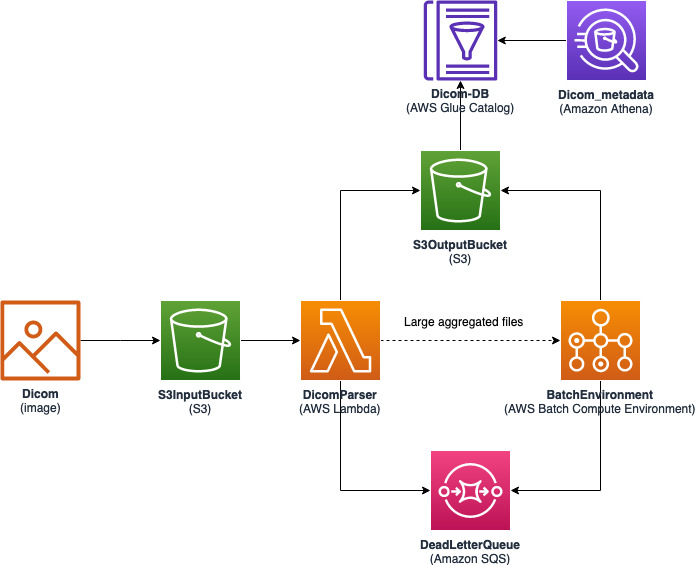
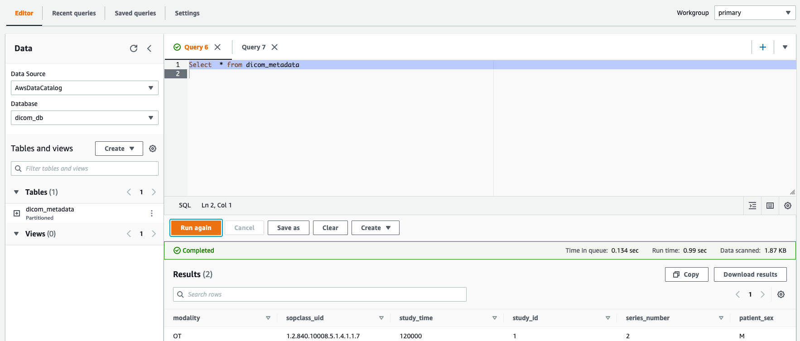
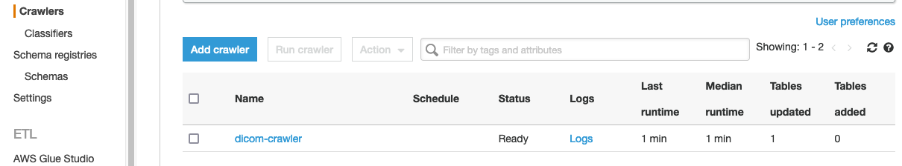
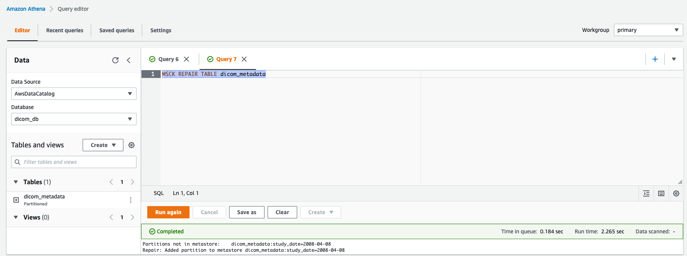

# Dicom Datalake

A serverless workflow to extract DICOM metadata to S3 and make it queryable via Athena. The architecture supports DCM, ZIP and TAR file extensions and assumes empty file extensions as DCM.

The dataset are partitioned by `study_date` tag, if not present will default to `1900-01-01` value.

## Design



## Installation

### Create ECR Repository and upload image

```sh
aws ecr create-repository --repository-name dicom-parser
REPO_URL=$(aws ecr describe-repositories --repository-name dicom-parser --query "repositories[].repositoryUri" --output text)
aws ecr get-login-password | docker login --username AWS --password-stdin $REPO_URL
echo $REPO_URL
```

### Deploy the Application using SAM CLI

The template can be deployed via web console or via CLI.

### SAM CLI

Install the AWS Serverless Application Model (SAM) CLI using these [instructions](https://docs.aws.amazon.com/serverless-application-model/latest/developerguide/serverless-sam-cli-install.html)

```sh
git clone github.com/aws-samples/dicom-metadata-extractor-datalake.git
cd dicom-metadata-extractor-datalake/
```

Build the application using SAM

```sh
sam build -t deploy/serverless.yml -m requirements.txt
```

Deploy the application using the guided process

```sh
sam deploy --guided --capabilities CAPABILITY_NAMED_IAM --image-repository $REPO_URL
# Replace MY_VALUE and MY_ACCOUNT_ID with proper resource names
Configuring SAM deploy
======================

        Looking for config file [samconfig.toml] :  Not found

        Setting default arguments for 'sam deploy'
        =========================================
        Stack Name [sam-app]: dicom-parser
        AWS Region [us-east-1]: us-east-1
        Parameter S3InputBucketName []: MY_VALUE-dicom-input
        Parameter S3OutputBucketName []: MY_VALUE-dicom-output
        Parameter VpcBatch []: vpc-MY_VALUE
        Parameter SubnetsBatch []: subnet-MY_VALUE,subnet-MY_VALUE
        Parameter ContainerMemory [1024]: 1024
        Parameter ContainervCPU [0.5]: 0.5
        Parameter LambdaMemory [256]: 256
        Parameter LambdaDuration [600]: 600
        Parameter AssignPublicIp [ENABLED]: ENABLED
        Parameter PartitionKey [study_date]: study_date
        Parameter GlueTableName [dicom_metadata]: dicom_metadata
        Parameter LogLevel [INFO]: INFO
        Parameter VersionDescription [1]: 1
        Image Repository for DicomParser [MY_VALUE.dkr.ecr.us-east-1.amazonaws.com/dicom-parser]: `HIT ENTER`
          dicomparser:latest to be pushed to MY_VALUE.dkr.ecr.us-east-1.amazonaws.com/dicom-parser:dicomparser-XXXXXXXXXXX-latest

        #Shows you resources changes to be deployed and require a 'Y' to initiate deploy
        Confirm changes before deploy [y/N]: y
        #SAM needs permission to be able to create roles to connect to the resources in your template
        Allow SAM CLI IAM role creation [Y/n]: y
        Save arguments to configuration file [Y/n]: y
        SAM configuration file [samconfig.toml]: `HIT ENTER`
        SAM configuration environment [default]: `HIT ENTER`
...

Previewing CloudFormation changeset before deployment
======================================================
Deploy this changeset? [y/N]: y
```

Next is to upload the DCM images to S3 Input bucket. Replace `S3InputBucketName` with correct value enter in SAM Deploy guided walk-thru.

```
aws s3 cp --recursive sample_dcm/ s3://S3InputBucketName/example/
```

Go to the Athena Web [Console](https://console.aws.amazon.com/athena/home) and select Database as `dicom_db`. Then run the following query:

```
Select  * from dicom_metadata
```



#### Advanced

The default schema is defined only captures portion of the DICOM standards. The Glue Crawler can be used to discover more tags in the set of DICOM Images.

Navigate to the Glue Crawler Web [Console](https://console.aws.amazon.com/glue/home#catalog:tab=crawlers) to select `dicom-crawler` and `Run Crawler`.

Wait until it completes.


**Note: For subsequent pushes run the `lambda_build.sh` for easier deployment**

```
./lambda_build.sh
```

### Troubleshooting

#### Study_date columns is empty or partitions

It is due to study_date being parsed as partition. The value will be found in the S3 Path `s3://bucket-name/study_date=1900-01-01/29035sjfkla923r.parquet` Run `MSCK REPAIR TABLE dicom_metadata` to add update the partitions or Glue Crawler. Additional information on error can be found [here](https://docs.aws.amazon.com/athena/latest/ug/msck-repair-table.html#msck-repair-table-troubleshooting)

Athena Console



Glue Crawler


#### GroupColumIO cannot be cast to PrimitiveColumnIO

Its due to mismatch in schema column type and type in parquet file. This can happen if DICOM image is cleaned but mismatch in value type. An example is an element requires a value type SQ `[]array<string>` but is replaced with `''<string>`. Additional information on error can be found [here](https://aws.amazon.com/premiumsupport/knowledge-center/hive-cannot-open-split-503-athena/)

#### Enable Debug in the Lambda and Batch logs

Via Cloudformation [Console](https://console.aws.amazon.com/cloudformation/home), select the `dicom-parser` stack.

1. Click Update on the upper right corner.
2. Select `Use current template` and click `Next`
3. In the parameters find `LogLevel` and select `DEBUG` from dropdown and click `Next`
4. Keep the default stack options and click `Next`
5. Review stack details and check blue box about IAM resources, then click `Update Stack`

Via SAM CLI

1. Find `samconfig.toml` file
2. Replace the configuration with `DEBUG`

   Before

   ```
   ... LogLevel=\"INFO\" ...
   ```

   After

   ```
   ... LogLevel=\"DEBUG\" ...
   ```

#### HIVE_PARTITION_SCHEMA_MISMATCH: There is a mismatch between the table and partition schemas.

This caused when the schema change and partitions have not been updates. To remove all partition you can run a command similar to this to delete all partitions:

```
aws glue get-partitions --database-name dicom_db --table-name dicom_metadata | jq ".Partitions[].Values[]" | xargs -L1 -I'{}' aws glue delete-partition --database-name dicom_db --table-name dicom_metadata --partition-values {}
```

Then via Athena console issue repair the table command or run Glue Crawler to repopulate partitions

Athena

```
MSCK REPAIR TABLE dicom_metadata
```

Glue Crawler

```
aws glue start-crawler --name dicom-crawler
```

